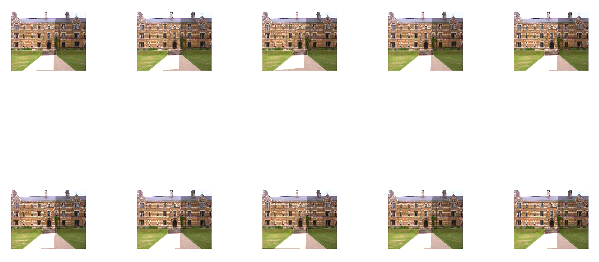

# TP 2 : Regression

Matheo Dumont p1602557

You can find my source code [here on my repository](https://github.com/MatheoDumont/ImStat).  
The code for this projet is located at : 
```
octave/tp2.m
```
If you want to run it, make sure to run `data/regression/vgg_warp_h/m`. In octave, i haven't found the right command, so i used some tricky things (in octave : right-click and run in the file browser section).

## Exercice 1 : Image registration with hand-picked pairs of points
After building the homography between `A` and `B`, and computing the transformation
we obtain a resulting Panorama by mixing the image A warpped that gives us `A'`, such as :
```
A' = vgg_warp_H(A, H)
```
and `B` like :
```
I = (A'/2 + B);
```
The resulting image is, with `A` on the left, in the middle the Panorama and `B` on the right :  

Now for the Panorama, the strong luminosity on the left is due to the accumulation of both image `A'` and `B`, although `A'` is divided.
Also, we can see, by adding those two images, that the homography does not transform well `A`, the left part is *blurry*, because `A'` and `B` does not overlap well.

We can also build a bigger image that contains A transformed relatively to B.

  
<P style="page-break-before: always">
  
## Exercice 2 : Image registration with detected pairs of feature points
I implemented the RANSAC algorithm, and used arbitrarily paremeters :
* `n` is the number of pair we pick each iteration.
* `n_iter` describe how many times we make to converge.

For `n_iter`, i've set it to `10`. For `n`, i would think that `1` is not enough, the homography could be rotated around, with `2` it could probably be translated and still rotated but on less axis, `3` is better but still has some fuzzy effect, so i choose `4` just to be sure.  
  
The model used to describe the error is the squared difference of the pixel in `B` and the pixel in `A'`. 
So for each iteration, we compute the homography `H` and transform `A` to `A'`, then using the pixel coordinates in B :

```cpp
h = homography(pick);
warpped = vgg_warp_H(A, h);

...

pix_A = warpped(pos_pix_B);
pix_B = B(pos_pix_B);
 
distance(A->B) = dot(pix_B - pix_A, pix_B - pix_A);
```

For 10 call to the implemented *RANSAC* algorithm, each image is the result using the pair of points returns by *RANSAC* with the parameters introduce earlier :  


As we can see, there's globally no aberrant result, except with the fourth image were outliers creates uncoherent images.
  
<P style="page-break-before: always">
  
Instead of using `n_iter`, we can use a threshold that the best distance/error mustn't exceed.
Using an arbitrarily defined threshold set at `200.0`, for 10 call again :   

This time, there is not a single outliers, all the result are seamingly good.
But on some image, we can see some lines that doesn't align well, the stairs on the fourth and ninth images, for example.
