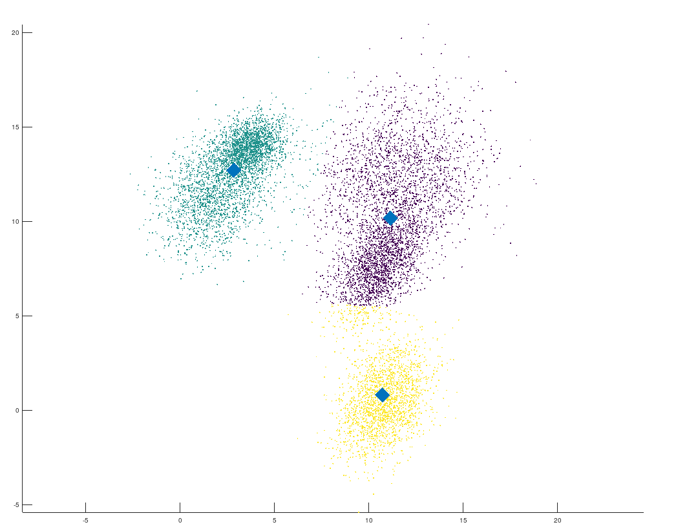

# TP 3 : Classication with K-Means and EM

Matheo Dumont p1602557  
You can find my source code [here on my repository](https://github.com/MatheoDumont/ImStat).

## K-means
You can find the implementation at `octave/tp3_kmeans.m`.

With 2D points and 3 classes, we get this results in about 10 sec :  

Kmeans stops when from one iteration to the next, no points are moved from one cluster to another.
  

## Expectation-Maximization 
You can find the implementation at `octave/tp3_EM.m`.

I haven't finished the implementation, the algorithm is here, but there's still some bugs, but it's still runnable.
The probabilities for each points are almost the same. 
